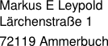
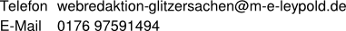

### About Glitzersachen

Auf [Glitzersachen.de] stelle [ich] technische Informationen und Quelltexte aus meinen
Projekten zur Verfügung. Augenblicklich (2013-07-10) ist [Glitzersachen.de] nur ein
"Portal" in einige meiner Projekte, die ich in den nächsten Monaten online stellen
möchte. Darüberhinaus will ich zur Zeit nichts versprechen.

  [Glitzersachen.de]: http://www.glitzersachen.de
  [ich]:              #impressum
  
### Impressum

#### Dieses Weblog ist ein publizistisches Angebot von:

#### Verantwortlicher im Sinne von § 5 TMG, § 55 RfStV:

So erreichen Sie mich:

### Copyright

Das Urheberrecht an den Inhalten [dieser Webseiten][Glitzersachen.de] liegt bei mir ([M E
Leypold]). Diese dürfen Sie ohne meine Erlaubnis nicht weiterverwenden (publizieren oder
in davon abgeleitet Werke integrieren).

Die [Style-Templates] habe ich unter GPL gestellt. Ich würde es aber vorziehen, wenn Sie
sich mit mir in Verbindung setzen würden, ehe Sie diese modifizieren, aus Gründen, die
näher erläutert sind in [About the Glitzersachen Webdesign - A Warning].

Die Lizenz unter der Ihnen die angebotenen Software- und Dokumentationspakete zur
Verfügung gestellt wird, ist in den jeweiligen Paketen dokumentiert. Sie finden diese
Information i.d.R in der Datei README oder LICENSE, die in dem betreffenden Paket
enthalten ist.

  [M E Leypold]:        #impressum
  [Style-Templates]:    http://github.com/m-e-leypold/m-e-leypold.github.io/
  
  [About the Glitzersachen Webdesign - A Warning]: http://www.glitzersachen.de/2013-07-10/about-the-style-templates-a-warning.html
  
### Kontakt

Zu Angelegenheiten, die mit [dieser Webpräsenz][glitzersachen.de] in Zusammenhang stehen,
können Sie mich über die im [Impressum] angegebene E-Mail-Adresse kontaktieren. 

Software und Dokumentation, die ich hier zur Verfügung stelle, sind in der Regel eigene
Webseiten zugeordnet (beispielsweise [TeachSWT]), auf denen besondere Kontaktadressen
angegeben sind. Verwenden Sie bitte diese.

Bitte kontaktieren Sie mich nicht, um mir Dienstleistungen oder Waren anzubieten.

  [impressum]:              #impressum
  [teachswt]:               teachswt.html
